# ADR-PROPOSTO: Fronteira de sincronização Pluggy, consumo Open Finance e controle de chamadas à instituição

> **Projeto:** `radar-pluggy`  
> **Branch analisada:** `staging`  
> **Data da consolidação:** 2026-09-07  
> **Status:** Proposto para consolidação / handoff de implementação  
> **Escopo:** Pluggy SDK, sincronização, paginação, Open Finance, limites operacionais, concorrência, persistência e evolução futura  
> **Sugestão de nome:** `docs/ADR/XXXX-fronteira-consumo-open-finance-pluggy.md`

---

## 0. Como usar este documento

Este ADR foi preparado para servir simultaneamente como:

1. registro das decisões já tomadas;
2. correção das premissas que foram derrubadas durante a investigação;
3. fotografia do código atual do `radar-pluggy`;
4. guia de implementação para mudanças imediatas;
5. desenho de evolução futura caso o serviço passe a provocar chamadas diretamente à instituição financeira;
6. contexto completo para uma nova conversa com Claude/Codex sem depender do histórico anterior.

### Regra de precedência

Quando houver conflito entre fontes:

1. **Código atual em `staging`** descreve o comportamento existente.
2. **Documentação oficial atual da Pluggy** descreve o contrato externo.
3. **Este ADR** registra a interpretação e as decisões atuais.
4. Skills/ADRs antigos do projeto devem ser corrigidos quando estiverem baseados em premissas antigas.
5. Documentos anteriores desta discussão que afirmavam que paginação de `GET` consumia quota Open Finance estão **superseded**.

Não reintroduzir decisões antigas apenas porque elas aparecem em um source histórico.

---

# 1. Decisão executiva

A principal decisão deste ADR é:

> **Uma requisição HTTP feita pelo `radar-pluggy` contra a API da Pluggy não deve ser tratada automaticamente como uma coleta Open Finance contra a instituição financeira.**

Existem duas fronteiras distintas:

```text
A) radar-pluggy -> API Pluggy

B) Pluggy -> instituição financeira / Open Finance
```

O sistema atual opera predominantemente na fronteira **A**, lendo dados que a Pluggy já coletou e armazenou.

A fronteira **B** acontece durante sincronizações do Item executadas pela Pluggy ou em operações explicitamente documentadas como chamadas diretas à instituição, como Real Time Balance.

Consequências imediatas:

- `GET /investments?page=1`, `page=2`, `page=3` não deve consumir um contador local de quota Open Finance.
- `GET /transactions`, `GET /accounts`, `GET /loans` e demais leituras de dados coletados não devem ser protegidos por um Admission Control de quota OF apenas por serem chamadas HTTP.
- paginação continua sendo importante por eficiência, rate limit técnico, consistência e resiliência, mas não por "1 página = 1 quota Open Finance".
- não criar agora tabelas de quota, continuation scheduler ou orçamento por página.
- o desenho de Admission Control continua válido como **arquitetura futura**, aplicado somente a operações que realmente provoquem consulta à instituição.
- o `radar-pluggy` **pode** provocar chamadas à instituição no futuro. Isso não é proibido. Deve fazê-lo deliberadamente, dentro do contrato da Pluggy e com proteção adequada.
- batch/cron próprio para manter Item atualizado continua proibido pela documentação da Pluggy.
- atualização manual/on-demand de Item é suportada pela Pluggy, sujeita a contrato, plano, frequência permitida, estado do Item e demais limitações.

---

# 2. Contexto do produto

## 2.1 Uso da Pluggy

Este projeto usa a Pluggy em contexto:

- **pessoal**;
- **não comercial**;
- com **plano gratuito**.

Não presumir:

- operação empresarial;
- grande base de clientes;
- necessidade de infraestrutura distribuída sem demanda concreta;
- que todo recurso de plano pago está disponível;
- que qualquer endpoint documentado está habilitado no plano atual.

Por outro lado, **plano gratuito não significa que a arquitetura esteja proibida de chamar a instituição**.

A regra é:

```text
pode consumir capacidade permitida
+
deve respeitar contrato e limites
+
não deve criar automação abusiva
+
não deve desperdiçar chamadas
```

---

# 3. Stack e arquitetura atual confirmadas no repositório

A revisão do `staging` confirmou:

| Item | Estado atual |
|---|---|
| Runtime | Node.js `>=24` |
| Linguagem | TypeScript |
| Pluggy SDK | `pluggy-sdk ^0.90.0` |
| DI | Awilix |
| ORM | Sequelize `^6.37.8` |
| Banco | **MySQL**, via `mysql2` |
| HTTP | Express |
| Valores monetários | `decimal.js` |
| Testes | Vitest |

## 3.1 Correção importante: não é Postgres

Um source anterior desta discussão assumia Postgres.

O código atual é explícito:

```ts
new Sequelize({
  dialect: 'mysql',
  ...
})
```

Portanto:

```text
POSTGRES como requisito arquitetural
= SUPERSEDED

MYSQL + Sequelize
= realidade atual
```

Qualquer solução de concorrência futura deve ser desenhada para MySQL/Sequelize.

Não usar:

- advisory lock específico de Postgres;
- `LISTEN/NOTIFY`;
- sintaxe ou semântica exclusiva de Postgres.

Preferir, quando necessário:

- constraints únicas;
- `UPDATE ... WHERE ...` condicional;
- transação;
- row lock / `SELECT ... FOR UPDATE`;
- lease persistido;
- padrões já existentes no serviço.

---

# 4. Regras estruturais do projeto que continuam vigentes

O projeto possui arquitetura em camadas com disciplina forte.

```text
src/
├── entities/
├── interactors/
├── adapters/
│   ├── gateways/
│   ├── repositories/
│   └── handlers/
├── infra/
│   ├── bootstrap/
│   ├── config/
│   ├── db/
│   ├── http/
│   ├── tools/
│   └── worker/
└── shared/
```

## 4.1 Um caso de uso, um gateway

Cada interactor:

- recebe `AppContainer`;
- extrai exatamente um gateway do próprio caso de uso;
- não conhece repositories concretos;
- não conhece Sequelize;
- não recebe `transaction`;
- não recebe API Key;
- não recebe token;
- não recebe lease;
- não deve carregar cursor técnico que só exista por mecanismo de infraestrutura, exceto quando a paginação em si fizer parte do contrato lógico já aceito no caso de uso.

Forma:

```text
Interactor
    |
    v
Gateway do caso de uso
    |
    +---- repositories
    +---- gateways de borda Pluggy
    +---- resolvers/provisioners compartilhados
```

## 4.2 Gateway de borda Pluggy

Arquivos `pluggy-*.gateway.ts`:

- falam a linguagem do SDK/HTTP;
- validam payload externo;
- convertem valores monetários para `Decimal`;
- traduzem falhas externas em `ApplicationError`;
- não fazem persistência.

## 4.3 Falha explícita

Dado obrigatório ausente não recebe default inventado.

Regra:

```text
obrigatório ausente
-> erro nomeado
-> nunca "assume 0"
-> nunca "assume que não mudou"
```

---

# 5. Distinção fundamental: três tipos de limite

Nunca misturar estes três conceitos.

## 5.1 Rate limit técnico da API Pluggy

É limite de tráfego:

```text
radar-pluggy -> Pluggy API
```

Exemplos documentados atualmente:

| Endpoint | Limite técnico |
|---|---:|
| `POST /auth` | 360 req/min/IP |
| `GET /transactions` e `GET /transactions/{id}` | 360 req/min/IP |
| `GET /investments` e `GET /investments/{id}` | 360 req/min/IP |
| `GET /investments/{id}/transactions` | 360 req/min/IP |
| `PATCH /items` | 20 req/min/IP |

Quando ultrapassado, o comportamento técnico documentado é HTTP `429`.

Este limite:

- não é a quota mensal Open Finance;
- não é por CPF;
- não é por instituição;
- não representa quantas vezes o banco foi consultado.

## 5.2 Limite operacional Open Finance

É imposto pelo ecossistema Open Finance sobre a recuperação dos produtos junto à instituição.

Identidade conceitual documentada:

```text
CPF/CNPJ + instituição + produto
```

Exemplos:

```text
mesmo CPF
+ mesmo banco
+ múltiplos Items
= compartilham o mesmo limite operacional
```

A Pluggy avisa explicitamente que criar múltiplos Items para a mesma combinação CPF/CNPJ + instituição faz os limites serem atingidos mais rapidamente.

## 5.3 Restrições de uso / contrato Pluggy

Exemplo:

- Pluggy é dona do processo de auto-sync;
- batch process próprio para manter Item atualizado é proibido;
- `PATCH /items` é destinado a atualização disparada pelo usuário;
- existem limitações adicionais de frequência e de plano;
- alguns fluxos exigem Connect Widget/MFA/reentrada de credenciais.

Esse terceiro grupo não deve ser reduzido a "rate limit".

---

# 6. Como a Pluggy sincroniza dados

A documentação atual descreve o Item como uma conexão a um Connector.

Durante a criação/sincronização:

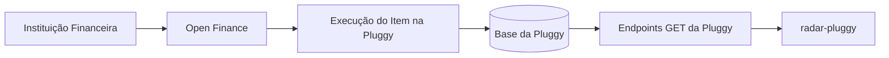

A Pluggy documenta que:

- ao criar um Item, coleta os produtos solicitados;
- puxa a informação da instituição;
- armazena os dados na base da Pluggy;
- depois os produtos coletados são acessados pelos endpoints de API.

Portanto o modelo mental correto é:

```text
Instituição
    |
    | coleta/sync
    v
Pluggy
    |
    | dados coletados persistidos
    v
GET /accounts
GET /investments
GET /transactions
GET /loans
    |
    v
radar-pluggy
```

---

# 7. Real Time Balance prova a existência da segunda categoria

A Pluggy possui:

```http
GET /accounts/{id}/balance
```

Esse recurso é explicitamente documentado como:

- consulta diretamente à instituição;
- não exige full Item sync;
- atualiza o `Account` armazenado na Pluggy;
- compartilha o limite operacional com a execução completa do Item.

Fluxo:

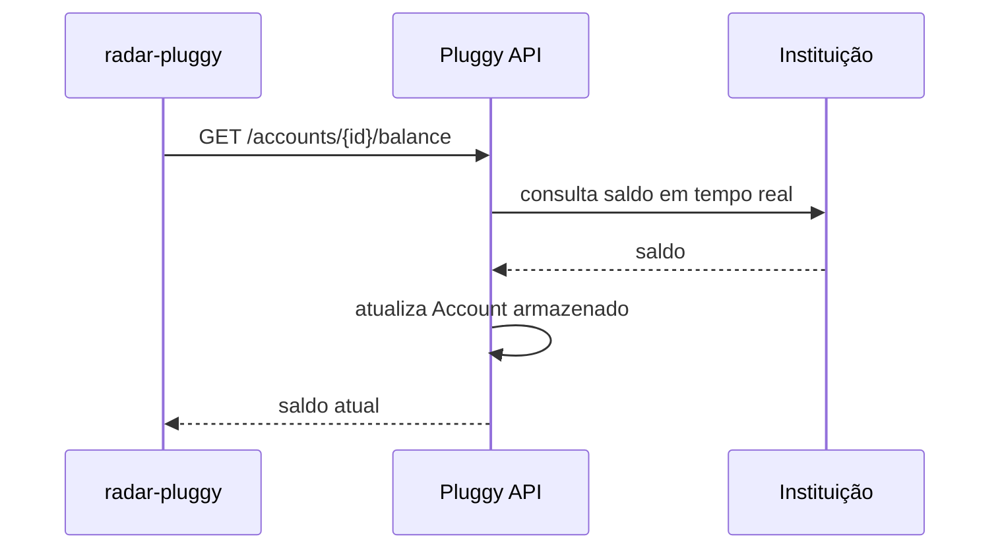

Essa operação é conceitualmente diferente de:

```http
GET /accounts/{id}
```

que lê o recurso já coletado.

---

# 8. Atualização manual de Item também alcança a instituição

A Pluggy documenta:

```http
PATCH /items/{id}
```

como operação que:

```text
dispara nova sincronização do Item com a instituição
```

Não concluir que `PATCH /items` é proibido.

O correto é:

```text
PATCH manual/on-demand
= suportado quando aplicável

batch/cron próprio para manter os Items atualizados
= proibido
```

A documentação diz que:

- a Pluggy mantém auto-sync;
- batch process próprio de manutenção é proibido;
- se o usuário precisar de atualização em tempo real, pode disparar update manual;
- o update pode acontecer pelo Connect Widget ou API direta quando o estado do Item permitir.

### Atenção ao plano gratuito

A disponibilidade concreta da atualização direta por API deve ser validada no momento da implementação.

A API documenta erros de plano/frequência como:

- `CLIENT_IS_UPDATING_BEFORE_ALLOWED_FREQUENCY`;
- `SANDBOX_CLIENT_ITEM_UPDATE_NOT_ALLOWED`;
- outros erros de estado/credencial.

Portanto:

> "arquiteturalmente podemos atualizar" não significa "o plano gratuito garante que qualquer forma de PATCH esteja disponível para qualquer Item".

Não codificar pressuposto de disponibilidade.

---

# 9. Limites Open Finance documentados

Estes números devem ser tratados como **política externa versionável**, nunca espalhados em código.

## 9.1 Accounts

| Produto/coleta | Limite mensal | Quando Pluggy coleta |
|---|---:|---|
| Account list & details | 4 | criação e a cada 7 dias |
| Account balance | 420 | cada update |
| Recent transactions, 1 a 6 dias | 240 | cada update |
| Non-recent transactions, 7 a 365 dias | 4 | criação e a cada 7 dias |

## 9.2 Credit Cards

| Produto/coleta | Limite mensal | Quando Pluggy coleta |
|---|---:|---|
| Credit card list & details | 4 | criação e a cada 7 dias |
| Bills & bill transactions | 30 | criação e 1x/dia |
| Credit card limits | 240 | cada update |
| Recent transactions, 1 a 6 dias | 240 | cada update |
| Non-recent transactions, 7 a 365 dias | 4 | criação e a cada 7 dias |

## 9.3 Investments

| Produto/coleta | Limite mensal | Quando Pluggy coleta |
|---|---:|---|
| Investment list | 30 | criação e 1x/dia |
| Investment detail | 4 | criação e a cada 7 dias |
| Investment balance | 120 | cada update |
| Recent investment transactions, 1 a 6 dias | 120 | cada update |
| Historical investment transactions, 7 a 365 dias | 4 | criação e on-demand |

## 9.4 Outros produtos

| Produto/coleta | Limite mensal | Quando Pluggy coleta |
|---|---:|---|
| Identity | 4 | criação e a cada 7 dias |
| Loans list & detail | 4 | criação e a cada 7 dias |
| Loans installments | 30 | criação e 1x/dia |
| Loans payments | 30 | criação e 1x/dia |

## 9.5 Período

A documentação de investimentos diz explicitamente que, se os limites de balance/transactions forem atingidos antes do fim do mês, novos dados não serão sincronizados até **o dia 1 do mês seguinte**.

Decisão:

```text
limite operacional documentado
= período de calendário mensal

não modelar como rolling window de 30 dias
```

Isso não significa que precisemos criar contador local agora.

---

# 10. Como o limite Open Finance aparece no Item

A documentação usa `PARTIAL_SUCCESS` e `statusDetail` para indicar falha parcial por produto.

Forma conceitual:

```json
{
  "executionStatus": "PARTIAL_SUCCESS",
  "statusDetail": {
    "accounts": {
      "isUpdated": false,
      "warnings": [
        {
          "code": "423",
          "message": "Open Finance monthly rate limit reached..."
        }
      ]
    }
  }
}
```

## 10.1 Não tratar limite como lista vazia

Regra vigente:

```text
produto sem dado
!=
produto não atualizado por limite
```

Nunca sobrescrever estado local como "zero", "sem investimento", "sem transação" apenas porque aquela coleta não foi atualizada.

## 10.2 Inconsistência atual da documentação Pluggy

Há páginas atuais em que:

```text
status = UPDATED
executionStatus = PARTIAL_SUCCESS
```

enquanto um exemplo específico da página de limites mostra `status: PARTIAL_SUCCESS`.

Logo, não usar o top-level `status` como única chave para detectar limite operacional.

Preferência:

```text
executionStatus
+
statusDetail.<product>.isUpdated
+
warnings
```

---

# 11. Achado importante no código: warning code possivelmente incompatível

Hoje:

`src/adapters/gateways/pluggy-history/load-pluggy-history.impl.ts`

contém:

```ts
const RATE_LIMIT_WARNING_CODES = [
  'RATE_LIMIT',
  'RATE_LIMIT_EXCEEDED',
  'PRODUCT_RATE_LIMIT_EXCEEDED',
]
```

A documentação oficial atual exemplifica:

```json
"code": "423"
```

## Decisão

Isso deve virar tarefa de validação imediata.

Não assumir que o código atual reconhece corretamente todos os limites Open Finance.

A implementação deve:

1. obter exemplos reais existentes em `pluggy_item_raw`;
2. comparar com a documentação atual;
3. preferencialmente criar uma tradução robusta e testada;
4. não depender de mensagem textual livre se houver código estável documentado;
5. não inventar códigos não observados/documentados.

Enquanto não validado, registrar como:

```text
RISCO: CLASSIFICAÇÃO DE RATE LIMIT PODE ESTAR FALHANDO
```

---

# 12. Estado atual do radar-pluggy: não há gatilho identificado de coleta direta

Na revisão atual do `staging` e no grep executado durante a investigação:

- não foi identificada chamada a `PATCH /items`;
- não foi identificado uso de Real Time Balance;
- não foi identificado caminho equivalente que force atualização da instituição.

O serviço atual usa principalmente:

```text
fetchItem
fetchInvestments
fetchLoans
fetch accounts
fetch account transactions
fetch investment transactions
fetch consents
```

Portanto, hoje:

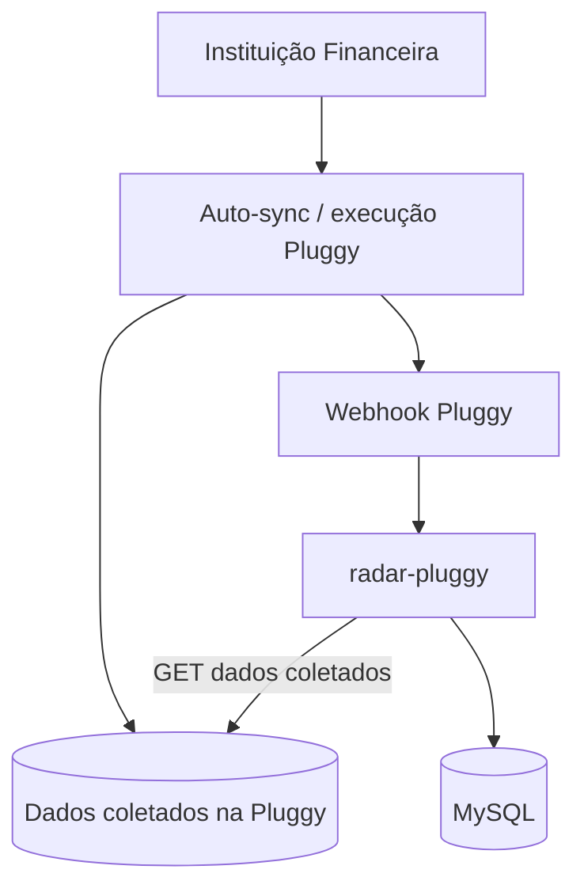

---

# 13. Classificação das operações usadas hoje

| Operação atual | Direção | Função | Trata como consumo OF local? |
|---|---|---|---|
| `fetchItem(itemId)` | radar -> Pluggy | lê estado/snapshot do Item | **Não** |
| `fetchInvestments(...)` | radar -> Pluggy | lê investimentos coletados | **Não** |
| `fetchLoans(...)` | radar -> Pluggy | lê loans coletados | **Não** |
| accounts paginados | radar -> Pluggy | lê contas coletadas | **Não** |
| transactions por cursor | radar -> Pluggy | lê transações coletadas | **Não** |
| investment transactions paginadas | radar -> Pluggy | lê movimentações coletadas | **Não** |
| consents | radar -> Pluggy | lê consentimentos | **Não por mera leitura** |
| `POST /auth` | radar -> Pluggy | autenticação API | **Não** |
| `PATCH /items/{id}` | ainda não existe | nova sincronização | **Sim, alcança a instituição** |
| Real Time Balance | ainda não existe | consulta FI diretamente | **Sim** |

Observação:

```text
"Não tratar como consumo OF local"
não significa "custo zero".

Ainda existe:
- tráfego;
- latência;
- rate limit técnico;
- CPU;
- memória;
- processamento;
- escrita em banco.
```

---

# 14. Decisão superseded: "1 página = 1 unidade de quota OF"

Essa decisão anterior está revogada.

## Antigo

```text
GET /investments page 1
= 1 quota OF

GET /investments page 2
= +1 quota OF
```

## Atual

```text
GET /investments page 1
= 1 request técnico Pluggy

GET /investments page 2
= 1 request técnico Pluggy

quota Open Finance
= ligada à coleta/sync contra a instituição,
  não à leitura de cada página do snapshot
```

Consequência:

- não pausar paginação só para "economizar quota OF";
- não criar `nextEligibleAt` por página;
- não criar continuation "amanhã buscar página 4" por motivo de quota OF;
- não criar budget mensal por página.

---

# 15. Paginação continua importante

Derrubar a hipótese de quota por página **não elimina a paginação**.

Hoje existem dois padrões principais.

## 15.1 Página numérica

Investimentos, loans e investment transactions:

```text
page = 1
page = 2
...
page = totalPages
```

O código:

- valida `page`;
- valida `totalPages`;
- recusa mudança de `totalPages` durante a varredura;
- usa `pageSize = 500` em vários gateways;
- evita acumulação onde o generator é usado.

## 15.2 Cursor

Account transactions:

```text
after = cursor
```

O código:

- extrai cursor do `next`;
- não segue URL arbitrária;
- mantém `visitedCursors`;
- recusa ciclo de cursor;
- entrega página a página.

---

# 16. Checkpoint e watermark: motivo correto

Checkpoint/watermark continua sendo boa arquitetura, mas sua justificativa foi corrigida.

## Não justificar por

```text
"cada GET gasta quota Open Finance"
```

## Justificar por

```text
evitar GETs redundantes
reduzir latência
reduzir tráfego técnico
evitar processamento duplicado
evitar escrita duplicada
detectar novidade
garantir varredura consistente
permitir recuperação segura após falha
```

---

# 17. Fluxo atual: webhook

O projeto já possui um padrão robusto de inbox + lease.

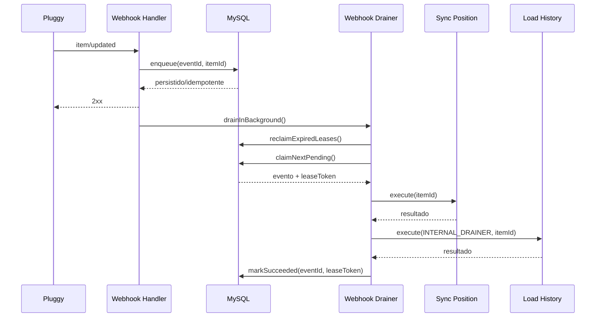

## Propriedades atuais

- idempotência por `event_id` único;
- lease de 10 minutos;
- claim por `UPDATE ... WHERE state = PENDING`;
- eventos do mesmo Item não são processados em paralelo;
- worker perdido não consegue concluir evento depois de perder o lease;
- lease expirado volta a `PENDING`;
- sem retry customizado em loop;
- falha devolve evento para `PENDING`;
- drenagem para depois de falha;
- máximo de 50 eventos por drenagem.

Esse padrão é importante porque demonstra como fazer coordenação em **MySQL**, sem Redis.

---

# 18. Recuperação no boot

`src/index.ts` chama uma drenagem uma vez ao subir.

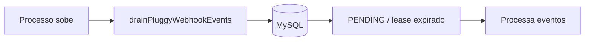

Isso:

- não é cron;
- não possui timer;
- não fica consultando a tabela;
- recupera trabalho persistido que ficou incompleto.

---

# 19. Fluxo atual: sincronização de posição

`SyncPluggyPositionInteractor`:

1. lê Item atual;
2. exige `executionStatus === SUCCESS`;
3. exige `lastUpdatedAt`;
4. compara com watermark persistido;
5. se não mudou, encerra;
6. valida consentimento;
7. pagina investimentos;
8. pagina loans;
9. só persiste depois de as varreduras necessárias terem concluído;
10. persiste snapshots;
11. avança watermark do Item por último.

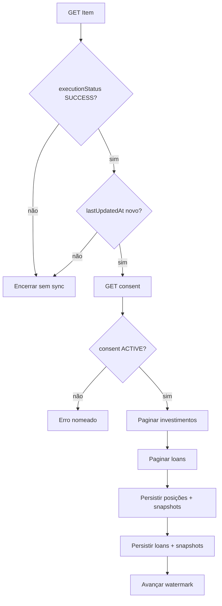

---

# 20. Ponto a revisar: posição não aceita PARTIAL_SUCCESS

Hoje existe uma assimetria relevante.

`SyncPluggyPositionInteractor`:

```text
aceita somente SUCCESS
```

`LoadPluggyHistoryInteractor`:

```text
aceita SUCCESS ou PARTIAL_SUCCESS
e avalia o estado de cada fonte
```

A documentação da Pluggy recomenda, em `PARTIAL_SUCCESS`:

- buscar os produtos com `isUpdated: true`;
- tratar os produtos que falharam separadamente.

## Decisão

Não alterar automaticamente neste ADR.

Criar tarefa de análise:

> Avaliar se posição deve passar a sincronizar investimentos/loans individualmente em `PARTIAL_SUCCESS` quando o `statusDetail` confirmar `isUpdated: true`, em vez de bloquear tudo.

Isso pode melhorar disponibilidade e evitar descartar dados válidos porque outro produto falhou.

---

# 21. Fluxo atual: carga de histórico

A carga de histórico já possui separação correta entre:

- estado do Item;
- estado por produto;
- fonte;
- cobertura;
- watermark de conclusão.

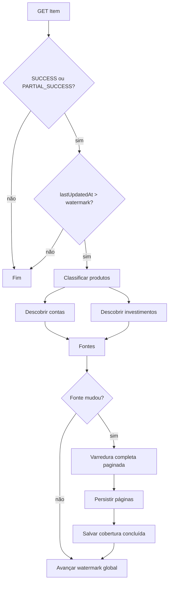

---

# 22. Persistência por página já existente

`LoadPluggyHistoryImpl.scanSource` persiste cada página antes do `yield`.

Isso é importante.

Se uma varredura falhar:

```text
páginas já persistidas
= continuam válidas/idempotentes

CompletedScan
= não é atualizado

watermark global
= não avança
```

Na próxima tentativa, o serviço pode repetir trabalho, mas não declara a varredura concluída antes da hora.

Isso é resiliência de ingestão.

Não remover esse mecanismo apenas porque a paginação não consome quota OF.

---

# 23. Estado de banco atual

O agregador de models atual inclui:

```text
Person (read-only, tabela de outro domínio)

PluggyCredential
PluggyCredentialItem
PluggyItem

PluggyPosition
PluggyPositionSnapshot

PluggyLoan
PluggyLoanSnapshot

PluggyAccount
PluggyAccountTransaction
PluggyInvestmentTransaction

PluggyHistoryCoverage
PluggyHistorySyncState

PluggyWebhookEvent
PluggyConsent

PluggyItemRaw
PluggyConsentRaw
PluggyPositionRaw
PluggyAccountRaw
PluggyAccountTransactionRaw
PluggyInvestmentTransactionRaw
PluggyLoanRaw
```

Tabelas próprias seguem a convenção física:

```text
radar_pluggy_*
```

O serviço não deve migrar tabelas de domínio externo como `people`.

---

# 24. Diagrama lógico simplificado de dados atuais

Este diagrama é lógico, não pretende afirmar todas as foreign keys físicas.

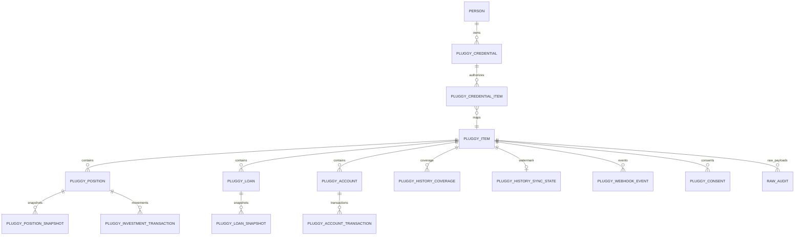

---

# 25. `connectorId`: lacuna estrutural real

`radar_pluggy_items` atualmente possui:

```text
item_id
person_id
status
execution_status
last_updated_at
timestamps
```

Não possui `connector_id`.

Por outro lado, o Item da Pluggy representa uma conexão com um Connector, e o payload bruto do Item é capturado em `PluggyItemRaw`.

## Por que isso importa

`itemId` representa:

```text
uma conexão técnica específica
```

`connectorId` representa:

```text
o Connector / instituição operacional da conexão
```

Para qualquer controle futuro por:

```text
pessoa + instituição
```

o `connectorId` precisa estar estruturado.

Também ajuda em:

- detectar múltiplos Items da mesma pessoa no mesmo Connector;
- auditoria;
- reconexões;
- evitar inferir instituição pelo nome;
- classificação de Connector Open Finance.

## Situação

```text
ACHADO REAL
mas migration ainda não foi formalmente aprovada neste ADR
```

### Proposta de evolução

Adicionar a `radar_pluggy_items`:

```sql
connector_id BIGINT UNSIGNED NOT NULL
```

somente depois de:

1. confirmar shape real do Item em `pluggy_item_raw`;
2. garantir backfill seguro para linhas existentes;
3. atualizar entity/model/repository;
4. atualizar testes de contrato;
5. não inferir connector pelo nome da instituição.

---

# 26. Comentários/documentação interna que estão incorretos

## 26.1 `pluggy-client.gateway.ts`

Comentário atual afirma que recriar cliente por chamada queimaria "a cota mensal do plano gratuito" devido a `/auth`.

Correção:

```text
POST /auth
= rate limit técnico
!= quota Open Finance
```

Cache do `PluggyClient` continua correto porque:

- evita autenticação redundante;
- reduz requests;
- reduz overhead;
- reutiliza API Key;
- evita aproximar-se do rate limit técnico.

## 26.2 `SyncPluggyPositionInteractor`

Comentário atual sugere que uma segunda leitura de Item "custaria cota".

Reescrever para deixar claro:

```text
evita request técnico redundante
não "quota OF"
```

## 26.3 Skill `fronteira-pluggy`, regra 6

A justificativa antiga diz que uma varredura de ~40 ativos "custa ~1230 leituras/mês" como argumento de limite Open Finance.

A marca d'água continua boa.

A justificativa correta é:

- não varrer sem necessidade;
- reduzir tráfego;
- reduzir latência;
- reduzir processamento;
- reduzir chance de rate limit técnico;
- evitar trabalho e escrita desnecessários.

Não:

```text
"GET transactions por ativo consome quota OF mensal"
```

## 26.4 Skill `fronteira-pluggy`, regra 7

Essência correta:

```text
não criar batch próprio para manter Item atualizado
```

A documentação oficial atual diz explicitamente que batch process de manutenção é proibido.

Manter.

Mas não interpretar como:

```text
PATCH /items nunca pode existir
```

Atualização manual/on-demand é documentada.

---

# 27. Decisões antigas explicitamente revogadas

| Decisão antiga | Estado |
|---|---|
| "1 página = 1 request = 1 quota OF" | **REVOGADA** |
| Admission Control em todos os GETs | **REVOGADA para o estado atual** |
| Orçamento mensal por página | **REVOGADO** |
| Paginação precisa esperar próximo dia por quota | **REVOGADA** |
| `open_finance_sync_continuation` necessário agora | **REVOGADO** |
| poller/scheduler para continuar páginas por quota | **REVOGADO** |
| Postgres é banco de coordenação do projeto | **REVOGADO**, projeto usa MySQL |
| `/auth` consome quota mensal OF/plano | **REVOGADO** |
| watermark existe principalmente para economizar quota OF | **REVOGADO como justificativa** |

---

# 28. O que NÃO deve ser implementado agora

Não criar agora:

```text
radar_pluggy_open_finance_quota_state
radar_pluggy_open_finance_sync_continuation
radar_pluggy_open_finance_budget
scheduler de quota
poller de quota
nextEligibleAt para GET paginado
budget decrementado em cada página GET
Admission Control envolvendo fetchInvestments/fetchLoans/etc
Redis
```

Nenhum desses componentes tem consumidor real hoje.

---

# 29. Podemos chamar a instituição no futuro

Decisão explícita:

> O `radar-pluggy` não é obrigado a permanecer apenas como leitor passivo do snapshot da Pluggy.

Podemos adicionar recursos como:

```text
"Atualizar agora"
Real Time Balance
outros recursos oficialmente suportados
que atinjam a instituição
```

Quando isso trouxer valor.

O objetivo não é:

```text
consumir zero quota
```

O objetivo é:

```text
usar a capacidade disponível
com necessidade real
sem desperdício
sem abuso
sem violar contrato
e sem bloquear outros fluxos importantes
```

---

# 30. Arquitetura futura: classificar a operação antes de proteger

Antes de implementar qualquer novo método SDK/endpoint, responder:

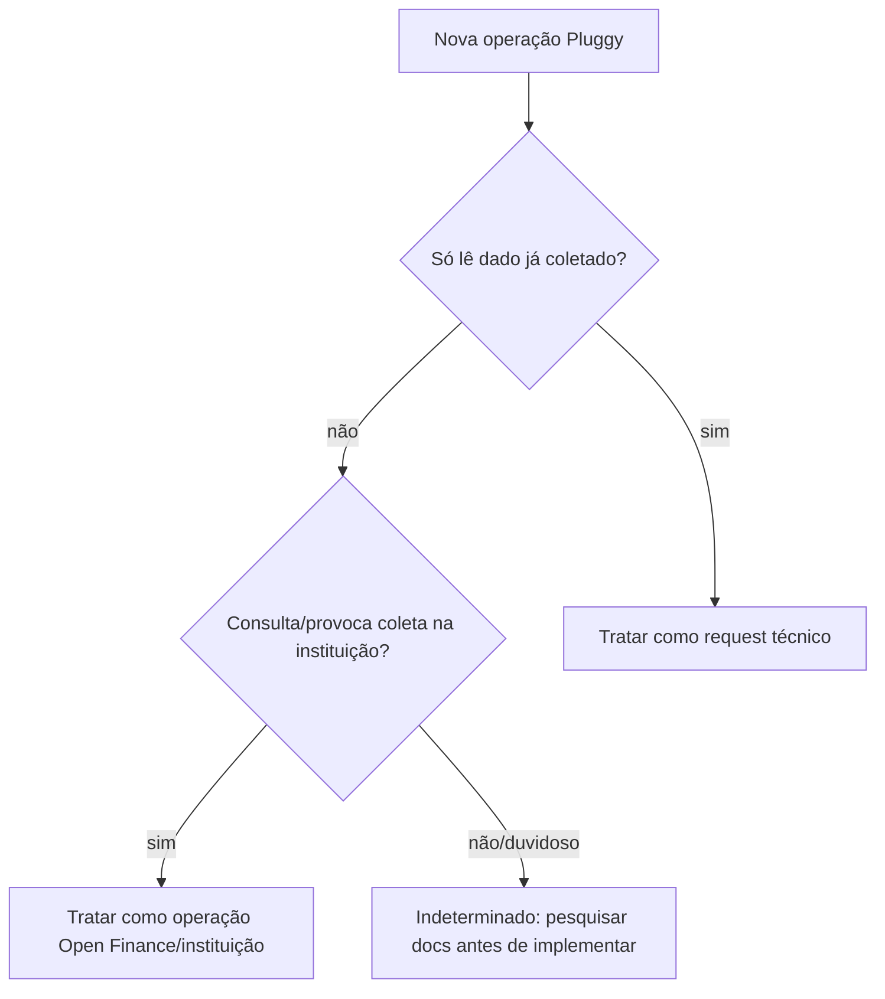

---

# 31. Matriz futura de política

Criar uma matriz somente quando novas operações relevantes forem adicionadas.

Shape recomendado:

| Campo | Exemplo |
|---|---|
| `sdkOperation` | `getRealTimeBalance` |
| `httpEndpoint` | `GET /accounts/{id}/balance` |
| `providerReadType` | `DIRECT_INSTITUTION` |
| `openFinanceProduct` | `ACCOUNT_BALANCE` |
| `operationalLimit` | `420/month` |
| `sharedWithItemExecution` | `true` |
| `technicalRateLimit` | documentado separadamente |
| `userTriggeredOnly` | conforme contrato |
| `supportsFreePlan` | validar no momento |
| `minimumClientInterval` | política nossa, se necessária |
| `concurrencyKey` | pessoa + connector + resource/operation |
| `retryPolicy` | sem retry customizado |
| `failureSemantics` | 429/403/502/etc |
| `observability` | call audit + outcome |

---

# 32. Admission Control futuro: escopo correto

Se surgir uma operação que atinja a instituição:

```text
Interactor
   |
   v
Gateway do caso de uso
   |
   v
Institution Call Guard / Admission Control
   |
   v
Pluggy SDK
   |
   v
Instituição
```

Não envolver automaticamente os gateways de leitura de snapshot.

---

# 33. Decisão futura do Admission Control

O Admission Control deve responder:

```text
1. Esta operação realmente precisa acontecer?
2. Ela é permitida pelo contrato/plano?
3. O Item/conta está em estado compatível?
4. Existe chamada equivalente em andamento?
5. Nossa política interna permite outra chamada agora?
6. Existe sinal explícito de bloqueio/rate limit?
7. Temos identidade suficiente para coordenar com segurança?
```

Se informação obrigatória para segurança estiver ausente:

```text
fail closed para A CHAMADA À INSTITUIÇÃO
```

Isso não deve derrubar:

- leitura de snapshots locais;
- leitura do MySQL;
- endpoints do portfolio;
- processamento que não necessite instituição.

---

# 34. Importante: não fingir saber a quota restante exata

A Pluggy faz auto-sync e essas execuções também consomem limites Open Finance.

Exemplo:

```text
120/month investment balance
```

Se o nosso serviço armazenar apenas:

```text
"eu fiz 3 chamadas"
```

não pode concluir:

```text
"restam 117"
```

porque a Pluggy pode ter feito auto-syncs entre elas.

Logo, uma futura tabela local não deve ser chamada de "saldo exato da quota" sem fonte autoritativa.

## O que podemos controlar de forma exata

```text
quantas chamadas nós iniciamos
quando iniciamos
qual operação
qual recurso
qual resultado
qual bloqueio observamos
```

## O que não sabemos automaticamente

```text
consumo exato total da rede
por todas as execuções automáticas da Pluggy
```

Até existir endpoint/provider signal que dê esse valor.

---

# 35. Tabelas futuras: proposta condicional

Estas tabelas **não devem nascer agora**.

São desenho para quando houver consumidor real.

## 35.1 `radar_pluggy_institution_calls`

Audit trail de chamadas que o `radar-pluggy` provocou contra a instituição.

```sql
id                    BIGINT UNSIGNED PK
person_id             BIGINT UNSIGNED NOT NULL
item_id               VARCHAR(36) NOT NULL
connector_id          BIGINT UNSIGNED NOT NULL

operation             VARCHAR(80) NOT NULL
resource_id           VARCHAR(80) NULL

initiated_by          VARCHAR(30) NOT NULL
requested_at          DATETIME(3) NOT NULL
completed_at          DATETIME(3) NULL

outcome               VARCHAR(30) NOT NULL
provider_status       INT NULL
provider_error_code   VARCHAR(100) NULL

quota_period          CHAR(7) NULL
created_at            DATETIME(3) NOT NULL
updated_at            DATETIME(3) NOT NULL
```

Possíveis `initiated_by`:

```text
USER
SYSTEM_EXPLICIT
```

Não usar `AUTO_CRON` para atualização de Item.

Possíveis `outcome`:

```text
RESERVED
SUCCEEDED
FAILED_BEFORE_SEND
FAILED_AMBIGUOUS
RATE_LIMITED
DENIED_BY_PLAN
DENIED_BY_POLICY
```

## 35.2 `radar_pluggy_institution_call_state`

Somente se for necessário coordenar concorrência/frequência.

```sql
id                    BIGINT UNSIGNED PK
person_id             BIGINT UNSIGNED NOT NULL
connector_id          BIGINT UNSIGNED NOT NULL
operation             VARCHAR(80) NOT NULL
resource_key          VARCHAR(100) NULL

period                CHAR(7) NULL
client_call_count     INT UNSIGNED NOT NULL

last_attempt_at       DATETIME(3) NULL
last_success_at       DATETIME(3) NULL

blocked_until         DATETIME(3) NULL
block_reason          VARCHAR(80) NULL

in_flight_until       DATETIME(3) NULL
in_flight_token       VARCHAR(64) NULL

created_at            DATETIME(3) NOT NULL
updated_at            DATETIME(3) NOT NULL
```

Unique conceitual:

```text
person_id
+ connector_id
+ operation
+ resource_key
+ period quando aplicável
```

### NÃO colocar

```text
remaining_open_finance_quota
```

a menos que seja de fato autoritativo.

`client_call_count` é honesto.

---

# 36. ER futuro condicional

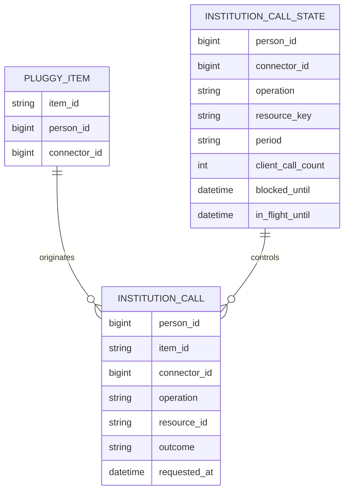

---

# 37. Concorrência futura em MySQL

Não fazer:

```text
SELECT state
if allowed:
    call Pluggy
UPDATE state
```

Dois requests concorrentes podem passar.

Preferência:

```text
transação curta
-> lock/conditional update
-> reserva exclusividade
-> COMMIT
-> chamada remota
-> transação curta
-> grava resultado
```

Nunca manter transação MySQL aberta durante chamada de rede se puder evitar.

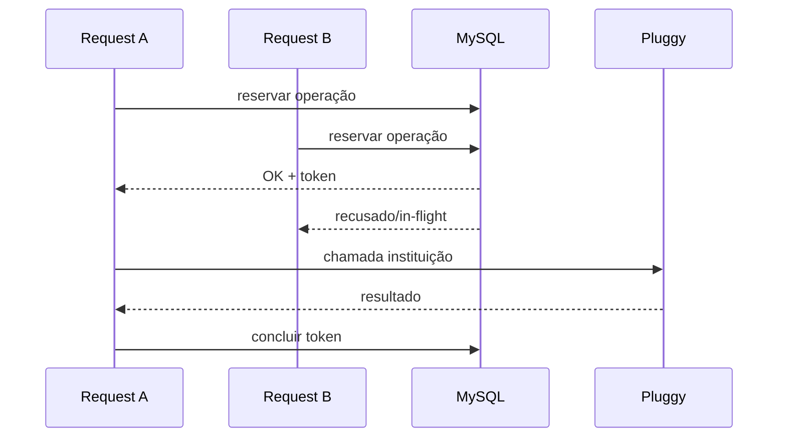

---

# 38. Reserva vs consumo futuro

Para chamadas reais à instituição:

### Caso 1: falhou antes de enviar

```text
DNS/configuração/validação local
-> pode ser marcado FAILED_BEFORE_SEND
```

### Caso 2: request pode ter chegado ao fornecedor

```text
timeout após envio
-> resultado ambíguo
```

Não repetir automaticamente.

Regra conservadora:

```text
ambíguo
-> não retry customizado
-> registrar
-> nova decisão passa novamente pelo guard
```

---

# 39. Sem scheduler por causa de quota

Como o motivo de "continuar página amanhã" foi derrubado, não existe hoje necessidade de:

```text
execute_at
sync_continuation
setInterval
poller
cron
```

para paginação/OF.

O worker existente continua:

- webhook-driven;
- boot recovery;
- rota manual quando aplicável.

---

# 40. Se surgir trabalho realmente agendado no futuro

Não transformar a regra "sem cron" em dogma absoluto para qualquer problema futuro.

Mas:

1. mudança deve ser explícita;
2. atualizar `arquitetura-camadas`;
3. definir pasta e ownership;
4. não usar scheduler para contornar proibição de batch de Item;
5. provar que o gatilho temporal é requisito real.

Hoje não existe esse requisito neste problema.

---

# 41. Fluxo futuro: "Atualizar agora"

Exemplo de feature futura.

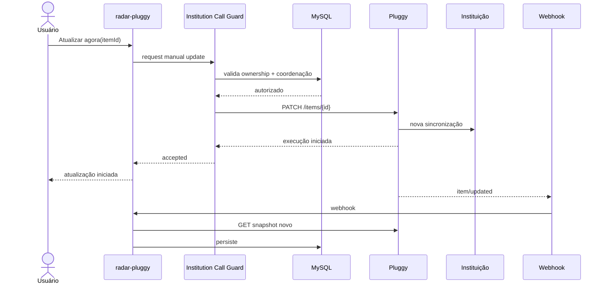

### Regras

- ação explícita;
- checar ownership;
- não disparar se já atualizando;
- respeitar frequência do fornecedor/plano;
- sem loop de retry;
- resultado chega naturalmente pelo webhook;
- não fazer polling agressivo.

---

# 42. Fluxo futuro: Real Time Balance

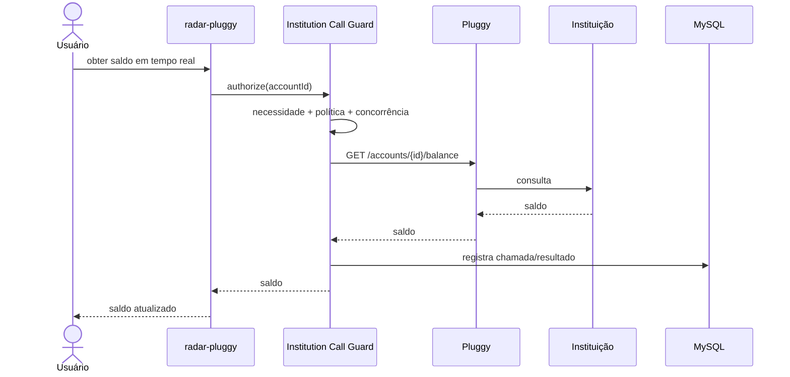

Esse endpoint compartilha limite com full item execution.

Logo, um contador local só deve representar **nossas chamadas**, não o saldo total da rede.

---

# 43. Não usar retry para quota mensal

Regra continua válida.

```text
quota mensal atingida
+ retry em 1s
= piora o problema
```

Além disso:

- SDK já possui comportamento próprio para certos 429 técnicos;
- não adicionar wrapper genérico de retry ao redor do Pluggy SDK;
- erros operacionais precisam de semântica, não repetição cega.

---

# 44. Cache do `PluggyClient`

O código cacheia um client por `clientId`.

Essa decisão continua correta.

Motivo:

```text
API Key fica na instância do SDK
+
reutilizar instância evita /auth redundante
```

Não justificar por quota OF.

---

# 45. Fluxos HTTP atuais

O servidor expõe atualmente, entre outros:

```text
POST /credentials
GET  /credentials/status

POST /items/:itemId/history/load

GET  /portfolio
GET  /accounts
GET  /accounts/:accountId/transactions

POST /webhooks/pluggy
POST /webhooks/pluggy/reconcile
```

### Carga manual de histórico

A rota:

```text
POST /items/:itemId/history/load
```

não significa "atualizar a instituição".

Ela:

- carrega histórico já disponível na Pluggy;
- depois dispara sincronização de posição em background;
- não foi identificada como `PATCH /items`.

Não confundir:

```text
manual history load
!=
manual institution refresh
```

---

# 46. Padrão de persistência atual a preservar

Posição/snapshot:

```text
transaction
  -> save current resource
  -> save raw payload
  -> save snapshot
commit
```

Histórico:

```text
cada página
  -> persist rows
  -> persist raw
  -> commit
  -> yield observation

somente ao final
  -> save CompletedScan
  -> advance watermark
```

Isso é boa separação entre:

```text
persistência parcial idempotente
e
declaração de conclusão
```

---

# 47. Raw payload é ativo de auditoria

O projeto persiste payload bruto de:

- Item;
- Consent;
- Position;
- Account;
- Account Transaction;
- Investment Transaction;
- Loan.

Uso recomendado para esta investigação:

1. inspecionar warnings reais de `statusDetail`;
2. confirmar `connector.id`/`connectorId`;
3. validar códigos de rate limit observados;
4. não depender apenas de exemplos de documentação.

Não usar raw como desculpa para não estruturar campos operacionalmente importantes.

---

# 48. Plano de trabalho recomendado para Claude

## Fase 0: não construir quota controller

Antes de qualquer feature nova:

```text
NÃO criar Admission Control
NÃO criar quota tables
NÃO criar scheduler
```

## Fase 1: corrigir conhecimento errado

Alterar comentários/skills que afirmam:

- GET paginado consome OF;
- `/auth` queima quota mensal;
- Postgres é o banco;
- `PATCH /items` nunca pode existir;
- watermark serve primariamente para quota OF.

## Fase 2: validar warning real

Consultar amostras existentes de `pluggy_item_raw`.

Comparar:

```text
warning.code
warning.message
product.isUpdated
executionStatus
```

com a documentação atual.

Adicionar testes.

## Fase 3: avaliar `PARTIAL_SUCCESS` de posição

Verificar se:

```text
investments.isUpdated = true
loans.isUpdated = true
```

podem ser processados mesmo quando outro produto falhou.

Não alterar sem teste/decisão explícita.

## Fase 4: avaliar `connectorId` estruturado

Preparar proposta de migration/backfill.

## Fase 5: inventário SDK x tipo de leitura

Manter uma tabela simples:

```text
SDK method
-> snapshot Pluggy
ou
-> instituição
```

Não precisa mapear toda a SDK antes de mudar uma linha.

Mapear de forma completa quando uma feature exigir novas operações.

---

# 49. Critérios de aceite imediatos

## Documentação

- [ ] Nenhum comentário afirma que página GET consome quota OF.
- [ ] Nenhum comentário afirma que `/auth` consome quota mensal OF.
- [ ] `fronteira-pluggy` distingue rate limit técnico e operacional.
- [ ] regra de batch mantém proibição correta.
- [ ] atualização manual/on-demand não é descrita como proibida.

## Código

- [ ] warning de rate limit atual da Pluggy é reconhecido corretamente.
- [ ] testes cobrem `PARTIAL_SUCCESS`.
- [ ] produto limitado nunca vira "lista vazia válida".
- [ ] nenhuma migration de quota é adicionada sem consumidor.

## Arquitetura

- [ ] banco tratado como MySQL.
- [ ] paginação continua resiliente.
- [ ] webhook inbox/lease continua intacto.
- [ ] nenhuma nova dependência Redis.
- [ ] nenhum cron introduzido sem requisito.

---

# 50. Testes recomendados

## 50.1 Paginação não altera quota OF local

Cenário:

```text
GET investments retorna 4 páginas
```

Esperado:

```text
4 requests Pluggy
0 decrementos de qualquer budget OF local
todas as páginas processadas
```

## 50.2 Watermark fechado

```text
freshItem.lastUpdatedAt <= persisted watermark
```

Esperado:

```text
não ler investimentos
não ler loans
não varrer transactions
```

Motivo:

```text
eficiência
```

não quota OF.

## 50.3 Warning `"423"`

Payload:

```json
{
  "executionStatus": "PARTIAL_SUCCESS",
  "statusDetail": {
    "accounts": {
      "isUpdated": false,
      "warnings": [{"code": "423", "message": "..."}]
    }
  }
}
```

Esperado:

```text
fonte accounts recusada explicitamente
não tratar como lista vazia
```

## 50.4 Parcial por produto

```text
accounts.isUpdated = false
investments.isUpdated = true
```

Esperado para histórico:

```text
caixa recusado
custódia processada
```

## 50.5 Cursor em ciclo

```text
next cursor repete cursor já visitado
```

Esperado:

```text
PLUGGY_TRANSACTIONS_CURSOR_CYCLE
```

## 50.6 totalPages muda

```text
page 1 totalPages = 3
page 2 totalPages = 4
```

Esperado:

```text
erro nomeado
não declarar scan concluído
```

## 50.7 Webhook duplicado

Mesmo `eventId`.

Esperado:

```text
uma única linha
um único processamento lógico
```

## 50.8 Worker perde lease

Worker A segura lease, expira, worker B reivindica.

Esperado:

```text
A não consegue marcar sucesso
B é dono válido
```

---

# 51. Testes futuros caso "Atualizar agora" seja implementado

## Concorrência

Duas ações simultâneas para mesmo Item:

```text
uma dispara update
outra recebe in-flight/already-updating
```

## Plano não permite

Pluggy retorna erro de plano.

Esperado:

```text
erro nomeado
sem retry customizado
sem loop
```

## Frequência

Pluggy retorna `BEFORE_ALLOWED_FREQUENCY`.

Esperado:

```text
registrar bloqueio
informar usuário
não repetir automaticamente
```

## Timeout ambíguo

Request pode ter chegado.

Esperado:

```text
não retry automático
registrar outcome ambíguo
aguardar estado/webhook/ação seguinte
```

---

# 52. Testes futuros caso Real Time Balance seja implementado

## Duplo clique

```text
2 chamadas simultâneas mesmo account
```

Política esperada:

```text
coalescer ou recusar segunda
```

## 429 da instituição

Esperado:

```text
registrar RATE_LIMITED
sem retry agressivo
não afetar GET normal do snapshot
```

## Falha da FI

`502`/`500`.

Esperado:

```text
falha só no real-time balance
GET local continua disponível
```

---

# 53. Observabilidade futura

Para operações que atinjam instituição, logar apenas metadados seguros:

```text
operation
itemId
connectorId
resourceType
outcome
latency
provider status/code
blocked reason
```

Não logar:

- credenciais;
- payload financeiro bruto no logger;
- CPF em texto;
- saldo/transações como contexto desnecessário.

Payload bruto continua no mecanismo auditável específico, quando permitido pelo desenho atual.

---

# 54. Segurança e privacidade

Continuam vigentes:

- credencial Pluggy nunca persistida no registro do Item;
- cliente/API key isolados por `clientId`;
- `IDENTITY` desligado até decisão de privacidade própria;
- webhook autenticado conforme regra existente;
- payload de webhook é gatilho, não verdade;
- dado monetário converte para Decimal na borda;
- raw data não deve vazar em `console.error`.

---

# 55. O que a investigação provou sobre "overengineering"

O desenho inicial com:

```text
quota state
sync checkpoint por quota
continuation
scheduler
Admission Control global
```

era coerente **se** cada página GET consumisse uma chamada OF.

A premissa estava errada.

Portanto a solução não deve ser implementada.

Isso não torna a investigação inútil.

Resultado correto:

```text
diagnóstico
-> derruba premissa
-> reduz arquitetura
-> preserva desenho futuro somente onde ele é aplicável
```

---

# 56. Decisões finais consolidadas

## Vigentes agora

1. API Pluggy e Open Finance são fronteiras diferentes.
2. GETs atuais leem dados coletados pela Pluggy e não são tratados como chamadas OF individuais.
3. Paginação não decrementa quota OF local.
4. Watermark/checkpoint continuam por eficiência e resiliência.
5. O banco atual é MySQL.
6. Worker atual continua reativo + boot recovery.
7. Sem cron/batch para manter Item atualizado.
8. Manual update é conceitualmente permitido quando suportado.
9. Real Time Balance é exemplo de chamada direta à instituição.
10. `PARTIAL_SUCCESS/statusDetail` deve impedir que falha de coleta vire dado vazio.
11. Não implementar Admission Control de quota nos GETs atuais.
12. Não implementar tabelas de quota agora.
13. Não implementar scheduler de continuação por quota.
14. Não usar Redis.
15. Não adicionar retry customizado no Pluggy.
16. `connectorId` estruturado é uma evolução importante a avaliar.
17. Warning code de rate limit atual precisa ser validado.
18. Comentários/skills baseados na premissa antiga precisam ser corrigidos.

## Futuras, condicionais

19. Se uma feature atingir instituição, classificar a operação antes de implementar.
20. Chamadas à instituição devem ser deliberadas e coordenadas.
21. Admission Control futuro fica somente na fronteira de chamadas à instituição.
22. Estado local deve contar chamadas iniciadas por nós, sem fingir conhecer quota total restante.
23. Coordenação futura usa padrões MySQL existentes.
24. Não segurar transação durante HTTP remoto.
25. Ausência de informação crítica faz fail-closed apenas para a chamada à instituição.

---

# 57. Questões ainda abertas

Estas questões não bloqueiam o funcionamento atual.

## 57.1 `connectorId`

- adicionar agora ou somente junto da primeira feature que precise dele?
- backfill pode vir diretamente de `pluggy_item_raw` com 100% de cobertura?

## 57.2 `PARTIAL_SUCCESS` na posição

- processar produto atualizado individualmente?
- quais `statusDetail` keys correspondem exatamente a loans?

## 57.3 Warning codes

- produção usa `"423"`?
- existem códigos nomeados além de `423`?
- SDK transforma o valor?

## 57.4 Feature "Atualizar agora"

- o plano gratuito atual permite API direta para os Items reais utilizados?
- deve usar Connect Widget em vez de `PATCH` direto?
- qual UX para MFA/consentimento?

## 57.5 Quota autoritativa

- a Pluggy oferece endpoint/metadata de consumo atual?
- se não, política local será deliberadamente conservadora e contará apenas nossas chamadas.

---

# 58. Arquitetura alvo atual

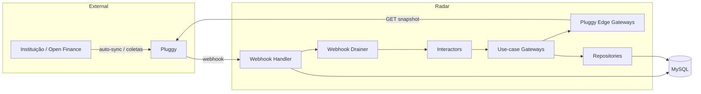

---

# 59. Arquitetura alvo futura quando houver chamada à instituição

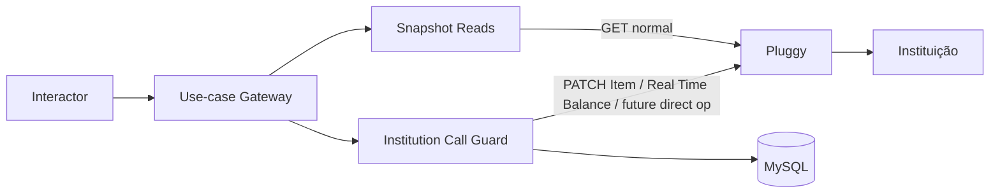

O ponto crítico:

```text
SNAPSHOT READS
não passam pelo guard de quota OF

DIRECT INSTITUTION OPS
passam
```

---

# 60. Prompt operacional para o Claude ao receber este ADR

Ao trabalhar neste repositório:

1. Leia `CLAUDE.md`.
2. Leia `.claude/skills/arquitetura-camadas/SKILL.md`.
3. Leia `.claude/skills/fronteira-pluggy/SKILL.md`, mas considere as correções deste ADR nas partes superseded.
4. Use `staging` como fotografia atual.
5. Não implemente uma solução antiga de quota por página.
6. Antes de editar, confirme no código o consumidor real.
7. Se uma mudança tocar Pluggy, classifique a operação como:
   - snapshot/API read;
   - direct institution/sync.
8. Não invente nova pasta sem decisão.
9. Não coloque mecanismos nos interactors.
10. Mantenha um gateway por caso de uso.
11. Não introduza Redis.
12. Use MySQL/Sequelize.
13. Não crie cron para Item update.
14. Não crie retry customizado.
15. Faça mudanças pequenas e testáveis.
16. Achado novo que contradiz este ADR deve ser reportado antes de expandir a solução.

---

# 61. Primeira tarefa recomendada para o Claude

Não começar por migrations de quota.

Começar por um PR pequeno de **reconciliação de conhecimento**:

```text
1. corrigir comentários incorretos sobre quota;
2. corrigir skill fronteira-pluggy;
3. validar warning code real;
4. adicionar testes do warning;
5. documentar explicitamente:
   GET snapshot != coleta OF.
```

Depois disso, decidir separadamente:

```text
connectorId estruturado
PARTIAL_SUCCESS por produto
```

---

# 62. Referências do repositório analisado

Branch: `staging`.

Arquivos especialmente relevantes:

```text
package.json

src/index.ts
src/infra/db/database.ts
src/infra/db/models.ts
src/infra/http/http-server.ts

src/infra/worker/webhook-drainer.ts

src/adapters/repositories/pluggy-webhook-event.rep.ts

src/adapters/gateways/pluggy-client.gateway.ts
src/adapters/gateways/pluggy-items.gateway.ts
src/adapters/gateways/pluggy-investments.gateway.ts
src/adapters/gateways/pluggy-loans.gateway.ts
src/adapters/gateways/pluggy-accounts.gateway.ts
src/adapters/gateways/pluggy-account-transactions.gateway.ts
src/adapters/gateways/pluggy-investment-transactions.gateway.ts

src/adapters/gateways/pluggy-position/sync-pluggy-position.impl.ts
src/adapters/gateways/pluggy-history/load-pluggy-history.impl.ts

src/interactors/pluggy-position/sync/sync-pluggy-position.interactor.ts
src/interactors/pluggy-history/load/load-pluggy-history.interactor.ts

src/entities/pluggy-item.ts
src/entities/pluggy-history-sync-state.ts

src/infra/db/models/pluggy-item-model.ts
src/infra/db/models/pluggy-webhook-event-model.ts

.claude/skills/arquitetura-camadas/SKILL.md
.claude/skills/fronteira-pluggy/SKILL.md
CLAUDE.md
```

---

# 63. Referências oficiais Pluggy consultadas

Documentação atual consultada em 2026-09-07:

```text
docs.pluggy.ai/docs/item
docs.pluggy.ai/docs/item-lifecycle
docs.pluggy.ai/docs/errors-validations

docs.pluggy.ai/docs/rate-limits
docs.pluggy.ai/docs/rate-limits-of

docs.pluggy.ai/docs/data-sync-update-an-item
docs.pluggy.ai/docs/updating-an-item

docs.pluggy.ai/docs/real-time-balance
docs.pluggy.ai/reference/account-balance-get

docs.pluggy.ai/reference/items-update
docs.pluggy.ai/reference/items
docs.pluggy.ai/reference/items-create

docs.pluggy.ai/reference/connectors-list
```

---

# 64. Nota sobre sources históricos desta investigação

Um documento anterior da discussão continha decisões baseadas na hipótese:

```text
cada página GET consome quota Open Finance
```

Esse documento é útil para entender a investigação, mas não deve ser usado como estado final.

As partes referentes a:

```text
quota por página
budget por página
continuation
scheduler
Postgres
Admission Control global
```

estão superseded por este ADR.

O contexto permanente mais recente, que distingue API Pluggy de Open Finance e permite chamadas intencionais à instituição, está alinhado com este ADR, com a correção adicional de que o banco real é MySQL.

---

# 65. Resumo de uma tela

```text
HOJE

Instituição
  -> auto-sync Pluggy
  -> snapshot Pluggy
  -> webhook
  -> radar-pluggy
  -> GETs paginados
  -> MySQL

GET paginado:
  request técnico Pluggy
  NÃO quota OF individual

Portanto:
  sem quota table agora
  sem Admission Control nos GETs
  sem continuation por quota
  sem scheduler por quota

Manter:
  watermark
  paginação
  persistência por página
  webhook inbox
  lease
  boot recovery
  statusDetail
  fail explícito

Corrigir:
  MySQL, não Postgres
  warning code 423
  comentários de quota
  skill fronteira-pluggy
  possível PARTIAL_SUCCESS da posição

FUTURO

Se adicionarmos:
  PATCH /items manual
  Real Time Balance
  outra chamada à instituição

Então:
  classificar operação
  adicionar guard somente nessa fronteira
  coordenar em MySQL
  auditar nossas chamadas
  não fingir conhecer quota total restante
  respeitar plano/contrato/rate limits
  sem batch abusivo
```

---

**Fim do ADR.**
